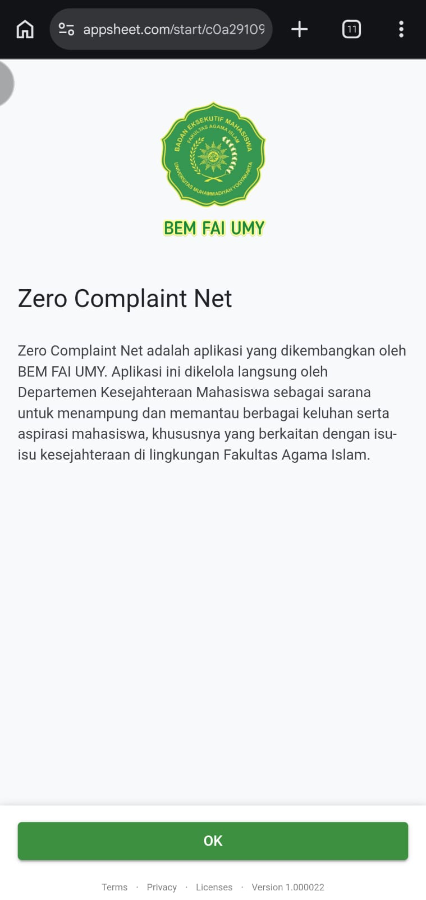

# Zero Complaint Net

A mobile-friendly no-code application developed using Google AppSheet for BEM FAI UMY.

## Project Information

- **Project Type:** Freelance Project
- **Date:** May 2025
- **Client:** BEM FAI UMY
- **Platform:** Google AppSheet
- **Role:** Freelance Developer · Application Design

## Overview

Zero Complaint Net is an application developed for BEM FAI UMY and managed by the Department of Student Welfare (Departemen Kesejahteraan Mahasiswa).

The application serves as a platform to collect and monitor student complaints and aspirations, particularly those related to student welfare within the Faculty of Islamic Studies.

The application also provides access to the FAI Filantropi donation program.

## Main Features

### 1. Complaint Submission

Students can submit complaints through a structured form containing:

- Name
- Study Program
- Complaint Type
- Complaint Details
- Attachment

### 2. Feedback Submission

A dedicated form allows students to submit feedback with:

- Name
- Study Program
- Feedback Type
- Feedback Details
- Attachment

### 3. FAI Filantropi

Provides information about the FAI Filantropi donation program and a dedicated donation submission form.

The donation form includes:

- Name
- Study Program
- Donation Amount
- Transfer Proof

### 4. Application Navigation

The application provides centralized navigation for:

- Home
- Laporan
- Masukan
- FAI Filantropi
- About
- Share

## My Contribution

- Designed the application structure and navigation.
- Translated project requirements into structured application workflows.
- Designed and configured forms for complaints, feedback, and donations.
- Configured AppSheet views and user-facing interfaces.
- Structured required fields and submission flows.
- Tested application flows and form functionality.
- Implemented application branding based on the client's organization.

## Tools & Technologies

- Google AppSheet
- Google Sheets
- No-Code Application Development
- Workflow Design
- Data Collection & Form Design
- User Interface Configuration

## Screenshots

### Home / Navigation

### Complaint Form

### Feedback Form

### FAI Filantropi

### About

## Project Context

The application supports BEM FAI UMY's student welfare initiatives by providing a centralised digital channel for complaints, feedback, and related student support activities.

## Disclaimer

This project was developed as a freelance project for BEM FAI UMY in May 2025. Screenshots are presented for portfolio purposes.
